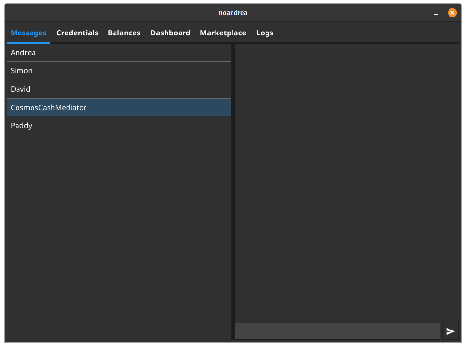

# Cosmos Cash Agent

The Cosmos Cash Agent is a prototype for an SSI edge agent with both credentials and token wallet capabilities.

It is build on [Aries framework](https://github.com/hyperledger/aries-framework-go) and the [Cosmos Cash](https://github.com/allinbits/cosmos-cash) project.

